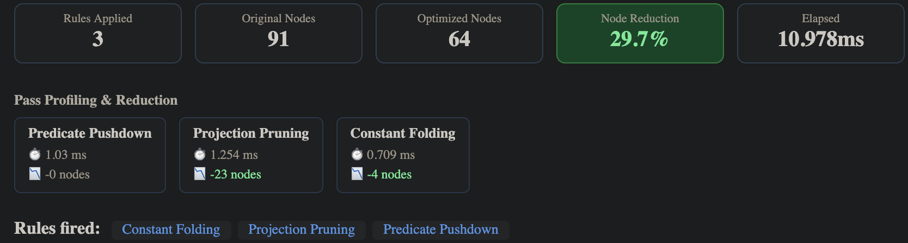
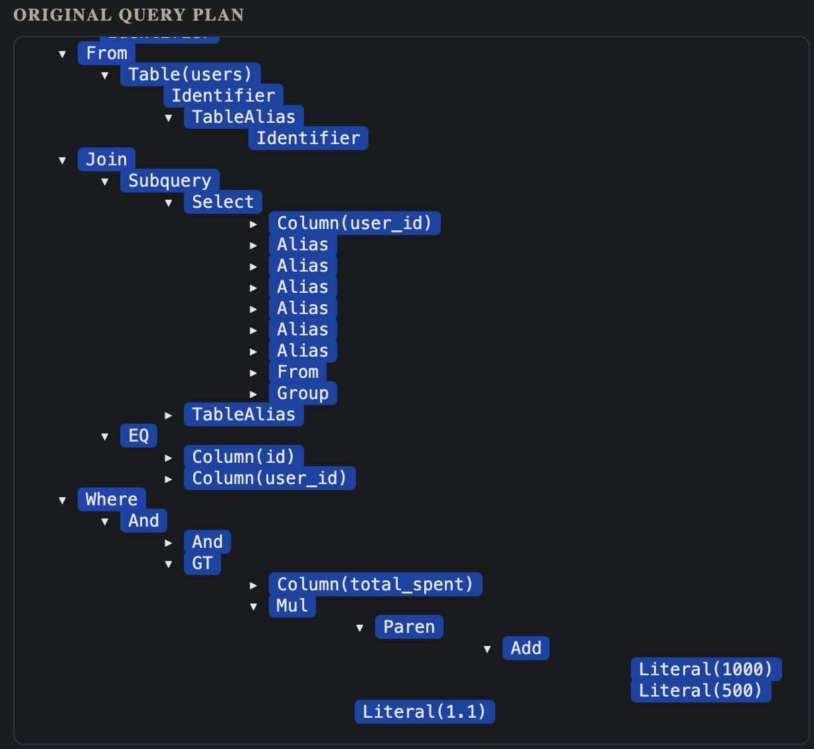
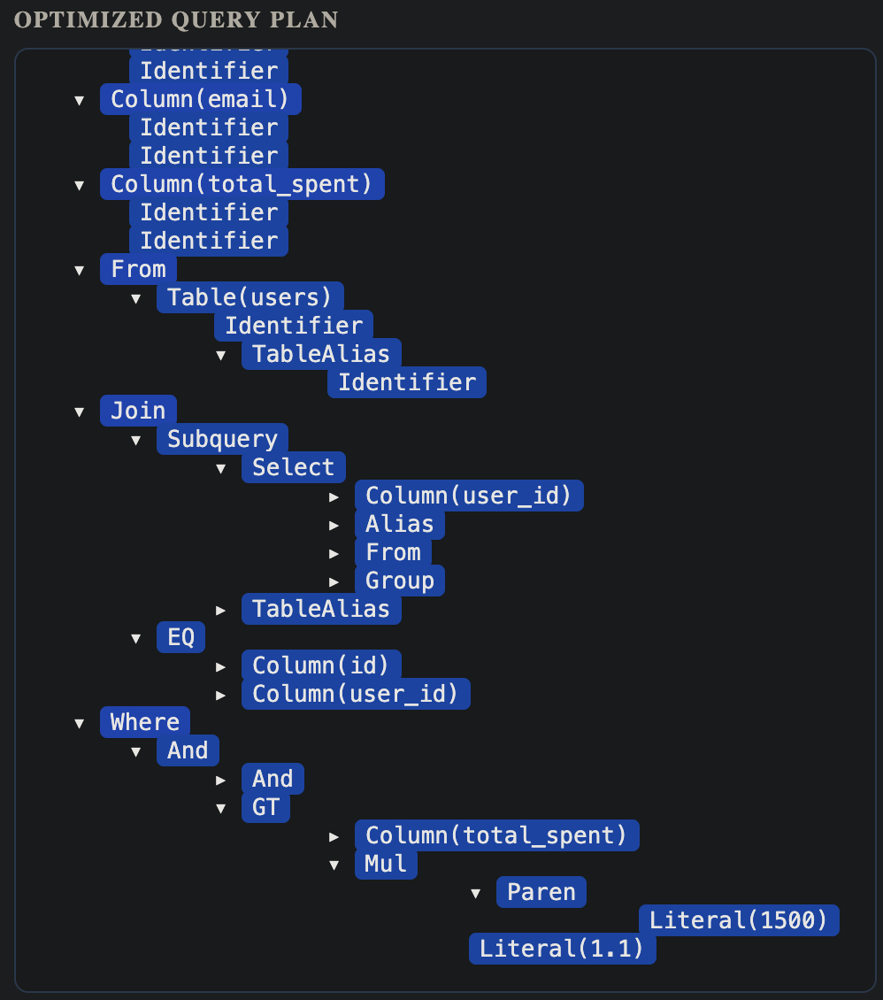

# QueryScope — SQL Query Optimizer & Plan Visualizer

A rule-based SQL query optimizer built in Python using `sqlglot` to parse queries into Abstract Syntax Trees (ASTs). It implements predicate pushdown, projection pruning, and constant folding as composable, order-independent rewrite passes over the logical plan. This backend is paired with a React frontend that renders before-and-after query plan trees as annotated node graphs, visually surfacing per-pass telemetry and AST node reduction metrics.

## Architecture

```text
QueryScope/
├── assets/              # Visualization screenshots for documentation
│   ├── dashboard_metrics.png
│   ├── original_plan.png
│   └── optimized_plan.png
├── backend/
│   ├── main.py          # FastAPI server entry point
│   ├── optimizer.py     # Core engine with fixed-point iteration loop
│   ├── validate_tpch.py # PostgreSQL correctness validation harness
│   ├── profile_complexity.py # Throughput profiling harness
│   └── requirements.txt  # Python dependencies
├── frontend/
│   ├── src/
│   │   ├── App.jsx      # Interactive tree visualization component
│   │   └── main.jsx     # React application entry point
│   ├── index.html       # Vite entry HTML
│   └── ...
└── README.md
```

### Optimization Passes

The optimizer runs in a fixed-point iteration loop, ensuring that all passes are fully composable and independent of execution order.

| Pass | Mechanism |
|------|-----------|
| **Predicate Pushdown** | Identifies single-table predicates in conjunctive WHERE clauses to reduce intermediate cardinality. |
| **Projection Pruning** | Eliminates unused column references from subquery SELECT lists via upward AST traversal. |
| **Constant Folding** | Evaluates deterministic scalar expressions bottom-up at compile-time (e.g., `(5 * 2) - 1` → `9`). |

## Performance & Optimization Results

QueryScope quantifies optimization impact through granular telemetry and AST node reduction tracking.

### 1\. Comprehensive Optimization Example

This complex analytical query involves nested subqueries and arithmetic designed to trigger all three rewrite rules simultaneously.

```sql
SELECT 
    u.username,
    u.email,
    summary.total_spent
FROM users u
JOIN (
    SELECT 
        user_id,
        SUM(price) AS total_spent,
        COUNT(order_id) AS order_count,
        MAX(price) AS max_price,
        MIN(price) AS min_price,
        AVG(price) AS avg_price,
        'INTERNAL_LOG_DATA' AS meta_tag
    FROM orders
    GROUP BY user_id
) summary ON u.id = summary.user_id
WHERE u.status = 'ACTIVE'
  AND u.access_level > (5 * 2) - 1
  AND summary.total_spent > (1000 + 500) * 1.1;
```

### 2\. Execution Telemetry

The engine identifies and eliminates redundant nodes across all passes. In this case study, the optimizer achieved a **29.7% reduction** in AST complexity by pruning 23 unreferenced nodes and folding 4 arithmetic nodes.



### 3\. Logical Plan Transformation

Strategic expansion of the AST reveals how "bloated" subquery projections are stripped and arithmetic branches are collapsed into literals.

| Original Plan (91 Nodes) | Optimized Plan (64 Nodes) |
| :--- | :--- |
|  |  |

## Validation & Profiling

To ensure physical and logical reliability, this engine includes two dedicated testing harnesses:

  * **Semantic Correctness (`validate_tpch.py`):** Validates optimization safety by executing both original and transformed ASTs against a live PostgreSQL database provisioned with deterministic TPC-H benchmark data, strictly asserting result-set equivalence.
  * **Complexity Profiling (`profile_complexity.py`):** Profiles rewrite pass throughput across synthetically scaled query complexities (1 to 50 nested JOINs) to identify algorithmic latency bottlenecks in the optimization pipeline.

## Prerequisites

To run the semantic validation harness (`validate_tpch.py`), you must have a local PostgreSQL instance and the TPC-H data generator tool:

  * **PostgreSQL:** Ensure a database named `tpch` is accessible.
  * **TPC-H dbgen:** Required for generating deterministic test datasets. Source and build instructions can be found here: [electrum/tpch-dbgen](https://github.com/electrum/tpch-dbgen.git).

## Running the Project

**1. Start the Backend:**

```bash
cd backend
pip install -r requirements.txt
uvicorn main:app --reload
```

**2. Start the Frontend:**

```bash
cd frontend
npm install
npm run dev
```

Open `http://localhost:3000` to interact with the visualizer.

## API Specification

**POST `/optimize`**

```bash
curl -X POST http://localhost:8000/optimize \
  -H "Content-Type: application/json" \
  -d '{"sql": "SELECT * FROM orders WHERE price > 10 + 5 * 2"}'
```

**Response Payload:**
Returns the complete `original_ast` and `optimized_ast` trees alongside granular telemetry:

```json
{
  "rules_applied": ["Constant Folding"],
  "pass_times": {
    "Predicate Pushdown": 0.12,
    "Projection Pruning": 0.45,
    "Constant Folding": 0.08
  },
  "pass_reductions": {
    "Predicate Pushdown": 0,
    "Projection Pruning": 0,
    "Constant Folding": 3
  },
  "original_node_count": 14,
  "optimized_node_count": 11,
  "reduction_pct": 21.4,
  "elapsed_ms": 1.25
}
```